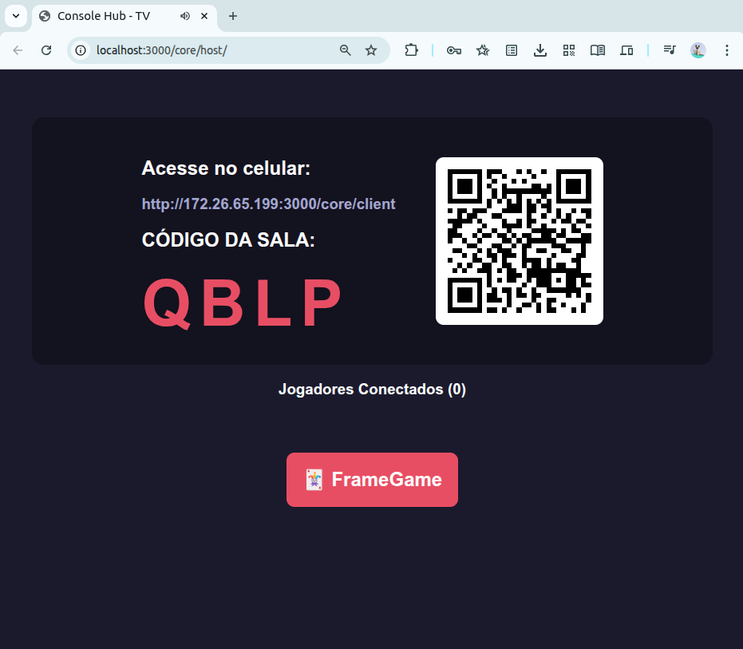
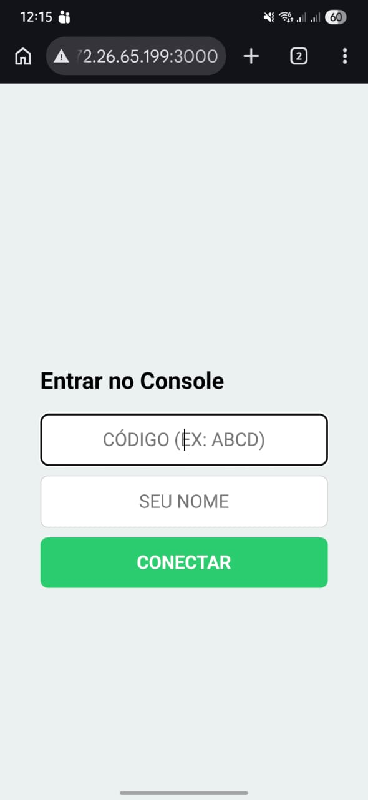
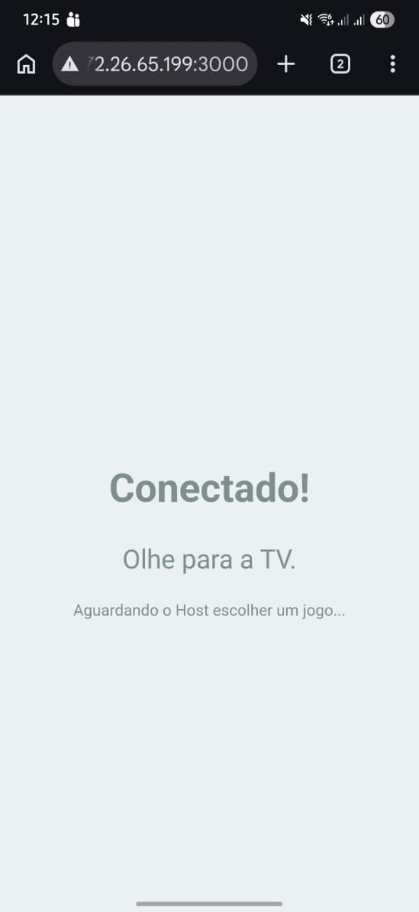
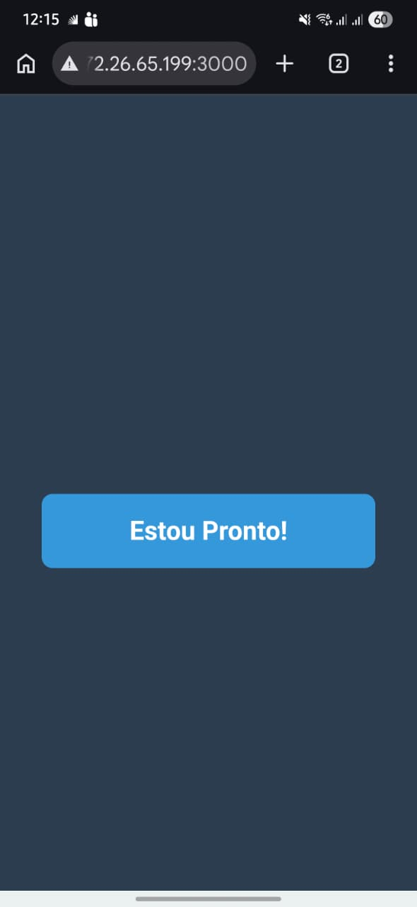
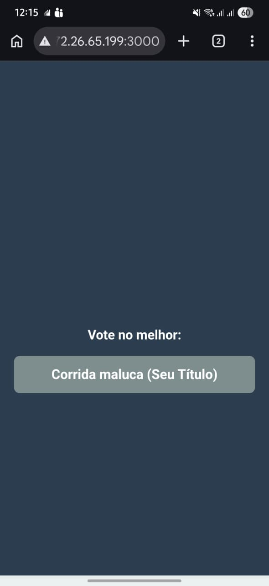
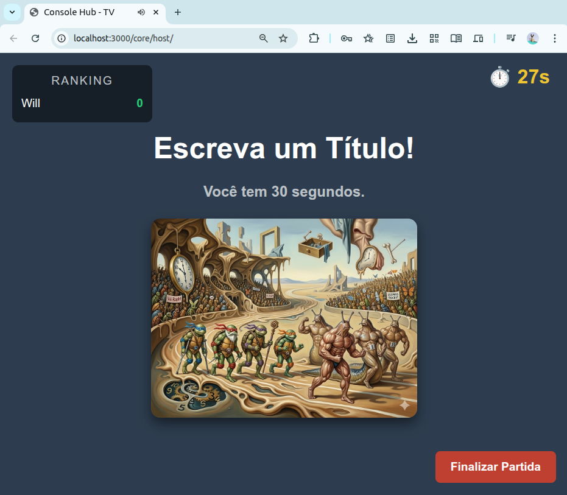
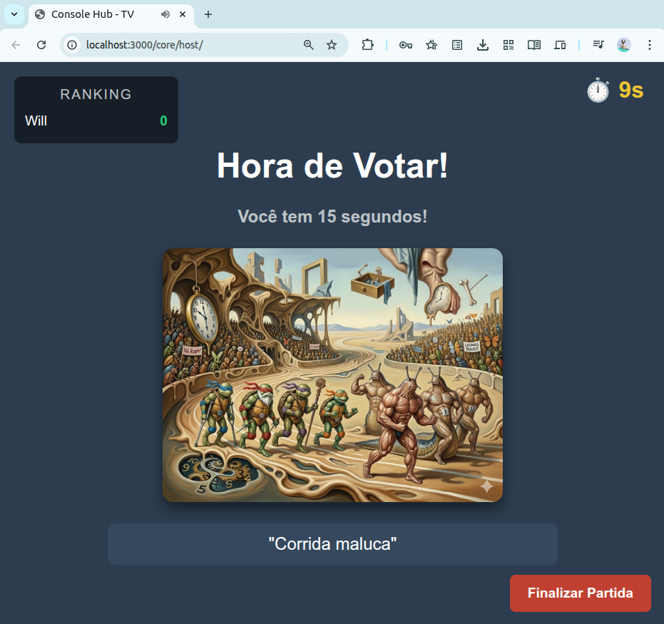
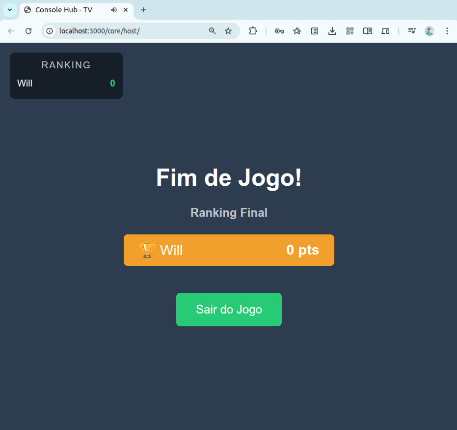

# 🎮 Will Hub Web Party Console

Um hub de jogos multiplayer local no estilo *Jackbox Games* ou *AirConsole*. Transforme qualquer tela (PC, Smart TV) no tabuleiro principal do jogo, enquanto os jogadores usam seus próprios smartphones como controles interativos através de uma conexão WebSocket de baixíssima latência.

## ✨ Funcionalidades

* **Zero Instalação para Jogadores:** Basta escanear o QR Code na tela principal para entrar na sala.
* **Comunicação em Tempo Real:** Sincronização de estado bidirecional usando WebSockets.
* **Arquitetura de Plugins (Microkernel):** O motor central (Core) é totalmente desacoplado dos jogos. Adicionar um novo minigame não afeta os jogos existentes.
* **Gerenciamento de Estado de Sala:** Suporte para fluxo de Lobby, Preparação, Jogo e Resultados.
* **Multiplataforma:** Desenvolvido para rodar nativamente em servidores Linux, Windows ou macOS, exigindo apenas um navegador nos clientes.

## 📸 Demonstração

### O Hub Principal (TV)

   

*Hub de seleção de jogos e pareamento via QR Code.*

### O Controle (Celular)

  
  
  
  

### Gameplay: Frame Game

  
  
  

## 🏗️ Arquitetura

O sistema adota um padrão de **Event-Driven Architecture** focado em roteamento de mensagens genéricas. 

* **O Core (`/public/core`):** Gerencia as salas, gera os códigos de pareamento e atua como um "Dispatcher". Ele recebe eventos arbitrários dos celulares e os repassa para a view da TV.
* **Os Plugins (`/public/games`):** Contêm a lógica visual e de negócios isolada de cada jogo (via IIFE). Quando um jogo é selecionado, os scripts são injetados dinamicamente na DOM e destruídos ao final da partida para evitar vazamento de memória.

## 🛠️ Tecnologias Utilizadas

* **Backend:** Node.js, Express.
* **Realtime Sockets:** Socket.io.
* **Frontend (Host & Client):** HTML5 (Canvas API), CSS3 e Vanilla JavaScript.
* **Utilitários:** QRCode.js.

## 🚀 Como Executar Localmente (Mac OS)

### Pré-requisitos
* [Node.js](https://nodejs.org/) (versão 18 ou superior recomendada).

### Instalação

1. Clone o repositório:
    git clone https://github.com/bitlabbr/Will-Hub.git
    cd will-hub

2. Instale as dependências:
    npm install

3. Inicie o servidor:
    node server.js

4. Acesse o Hub Principal no navegador da máquina host:
    http://localhost:3000

## 🧩 Como Criar e Contribuir com Novos Jogos

A beleza deste console é a facilidade de expansão. Para criar um novo jogo:

1. Crie uma nova pasta em `public/games/seu-jogo/`.
2. Crie os arquivos `host-game.js` (rodará na TV) e `client-game.js` (rodará no celular). Envolva seu código em uma função auto-executável `(() => { ... })();` para isolar o escopo.
3. No `host-game.js`, escute os eventos dos jogadores. Exemplo:
    window.addEventListener('ClientActionEvent', (e) => {
        const action = e.detail; // { playerId, type, payload }
        // Lógica do seu jogo aqui
    });

4. No `client-game.js`, envie comandos para a TV. Exemplo:
    window.sendGameAction('mover_personagem', { direcao: 'esquerda' });

5. Adicione o botão de atalho do seu jogo no `public/core/host/index.html` apontando para o nome exato da sua pasta:
    
🎮 Meu Novo Jogo

## 👨‍💻 Autor

**Willian Santos**
*Engenheiro de Software*

Sinta-se à vontade para abrir *issues* e enviar *Pull Requests* com novos minigames para o console!
